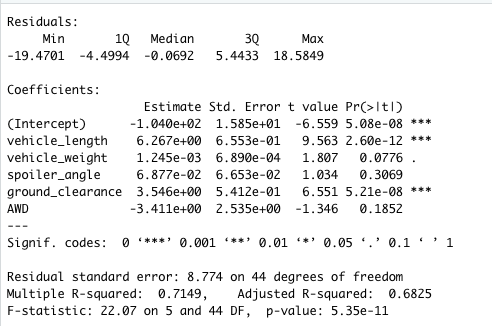
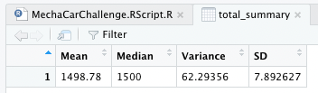
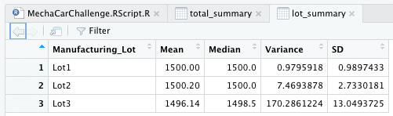
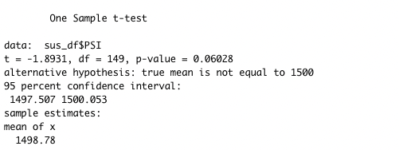
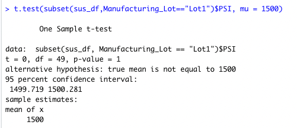
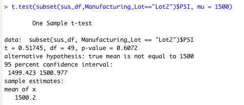
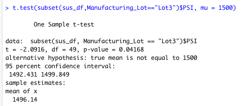

# MechaCar Statistical Analysis

## Project Purpose

The purpose of the project is to perform statistical analysis to identify which variables in the dataset predict the MPG of the MechaCar prototypes. And then review these insights and help the manufacturing team.

## Linear Regression to Predict MPG

The most sigificant variables in the dataset that provided a non-random amount of variance to the MPG values were Vehicle Length and Ground Clearance. The P-Values for these variables are 2.60e-12 and 5.21e-08 respectively. The intercept is also statistically significant with a P-Value of 5.08e-08.

The slope can't be considered to be zero. This is because the P-Value is so low at 5.35e-11 that the null hypothesis is rejected. Tells us that the releationship between MPG and the dataset variables is subject to more than random chance. 

The r-squared value is at 0.7149 meaning the linear regression model is 71% accurate. Meaning there are more than likely other variables that are significant. So the model is somewhat effective however it could be improved.

## Summary Stats on Suspension Coils

Looking at the Total Summary, the variance is below 100 at 62.29 and meets expectations. However Lot 3 has a variance of 170.28 which is greater than the limit of 100. This means Lot 3 does not meet the design specification. 

## T-Tests on Suspension Coils

### All Lots T-Test

Looking at the T-Test for all lots it's apparent that the coils from all lots aren't statistically significant. This is because the P-Value is at 0.06028 which isn't low enough to reject the Null Hypothesis.

### Lot 1 T-Test

With a P-Vlaue of 1 Lot 1 is not statistically significant enough to reject the null hypothesis. 

### Lot 2 T-Test

With a P-Vlaue of 0.607 Lot 2 is still slightly too high of a P-Vlaue to reject the null hypothesis. 

### Lot 3 T-Test

Lot 3 has a P-Vlaue of 0.04168 which is just below 0.05 and using a confidence level of 95 percent meaning the results are statistically significant and we can reject the null hypothesis.

## Study Design: MechaCar vs Competition

Multiple factors must be taken into account when considering to purchase a car. In today's environment of rapidly increasing inflation spiking fuel prices, and overall increases in cost of living consumers will be looking for a car with low maintenance cost. 

### Metric to Test

In this study we'll analyze MechaCar's average yearly maintenance cost in comparison to the competition.

### Null Hypothesis

MechaCar's average yearly maintenance cost is similar to competitor's vehicles.

### Alternative Hypothesis

MechaCar's average yearly maintenance cost is statistically lower than the competition.

### Statistical Test Used

For this study, the best statistical test would be the two-sample t-test because we are testing for the difference between the distribution from two samples but for one variable. 
